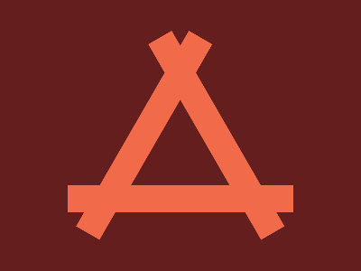
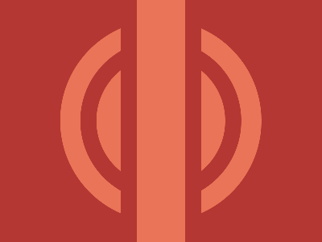
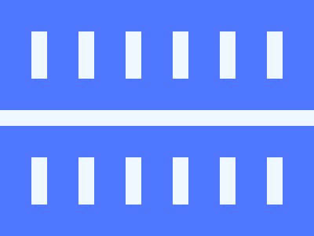
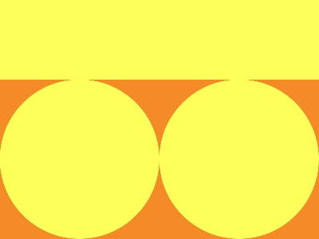
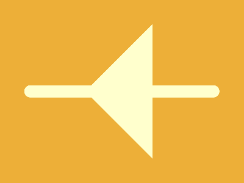

# cssbattle-solutions

# Descrição

As soluções dos desafios do <a href="https://cssbattle.dev/" target="_blank">CSSBattle.dev</a> encontrados neste repositório refletem a abordagem que adotei durante meu processo de reaprendizagem de HTML5 e CSS3. Não necessariamente seguem as práticas mais atualizadas, mas representam a maneira como resolvi os desafios até o momento. Planejo revisá-los no futuro, aplicando novos conhecimentos adquiridos em cursos, explorando diferentes métodos para solucioná-los, e comparando o resultado final com o código que escrevi inicialmente. Além disso, não me preocupei em otimizar o código para atender aos critérios de pontuação do CSSBattle, priorizando em alguns casos uma abordagem mais descritiva para melhor compreensão.

Os links para cada desafio estão em suas respectivas páginas.

# Soluções

## Battle #1 - Pilot Battle

## Battle #21 - Rotate

## Battle #26 - Initial

## Battle #27 - Relative

## Battle #29 - Font

## Daily targets

