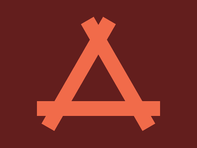

# Daily target #2024-4-29

```HTML
<div class="objeto1"></div>
<div class="objeto2"></div>
<div class="objeto3"></div>
<style>
  body {
    background-color: #631E1D;
  }
  div {
    width: 30px;
    height: 250px;
    background-color: #F16B4A;
  }
  .objeto1 {
    transform: rotate(90deg) translateX(87px) translateY(-177px);
  }
  .objeto2 {
    transform: rotate(30deg) translateX(2px) translateY(-270px);
  }
  .objeto3 {
    transform: rotate(-30deg) translateX(430px) translateY(-310px);/*REVISAR: Apesar da conclusão, não entendi exatamente como foi definida a distância dos objetos em relação ao centro de rotação*/
  }
</style>
```

---


---

Desafio concluído em: 11/05/2024

[Link para o Daily target #2024-4-29](https://cssbattle.dev/play/tZs9BX11EYMYKm7rt2Z2) em [CSSBattle.dev](https://cssbattle.dev/).