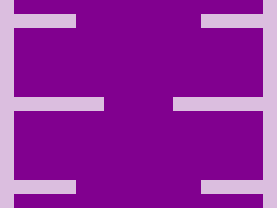

# Daily target #2024-6-25

## 1° método

617 caracteres em 25/06/2024.

```HTML
<div class="conjunto">
  <div class="box a"></div>
  <div class="box"></div>
  <div class="box a"></div>
  <div class="box a b"></div>
  <div class="box"></div>
  <div class="box a b"></div>
</div>
<style>
  body {
    margin: 0 20px;
    background: #DBBEDF;
  }
  .conjunto {
    display: flex;
    flex-direction: column;
    flex-wrap: wrap;
    justify-content: space-between;
    height: 100%;
    gap: 30px 100px;
    background: #81008F;
  }
  .box {
    width: 130px;
    height: 20px;
    margin: 20px 0;
    background: #DBBEDF;
  }
  .a {
    width: 90px;
  }
  .b {
    align-self: flex-end;
  }
</style>
```

---


---

[Link para Daily target #2024-6-25](https://cssbattle.dev/play/qKIRr3xZYc2T6RJLdmSy) em [CSSBattle.dev](https://cssbattle.dev/).