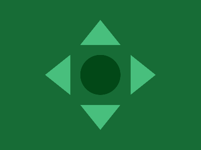

# Daily target #2024-7-11

## 1° método

777 caracteres em 11/07/2024.

```HTML
<div class="seta-1"></div>
<div class="seta-1 seta-2"></div>
<div class="seta-1 seta-3"></div>
<div class="seta-1 seta-4"></div>
<div class="circulo"></div>
<style>
  body {
    background: #176C36;
  }
  div {
    position: absolute;
    top: 40px;
    left: 160px;
    width: 0;
    height: 0;
  }
  .seta-1 {
    border-right: 40px solid transparent;
    border-bottom: 50px solid #48BF7D;
    border-left: 40px solid transparent;
  }
  .seta-2 {
    transform: rotate(0.25turn) translate(85px, -85px);
  }
  .seta-3 {
    transform: rotate(0.5turn) translate(0, -170px);
  }
  .seta-4 {
    transform: rotate(0.75turn) translate(-85px, -85px);
  }
  .circulo {
    top: 110px;
    width: 80px;
    height: 80px;
    border-radius: 50%;
    background: #024817;
  }
</style>
```

---


---

[Link para Daily target #2024-7-11](https://cssbattle.dev/play/jF7qZRcYICI3uTe3mUFn) em [CSSBattle.dev](https://cssbattle.dev/).